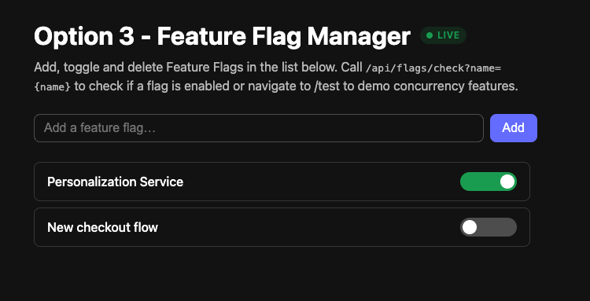
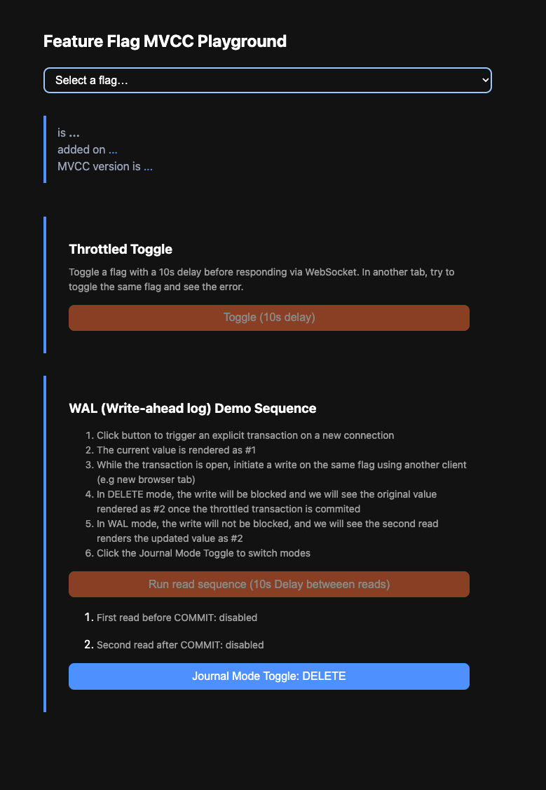
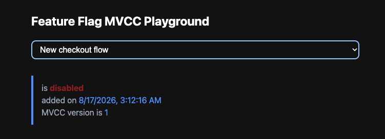
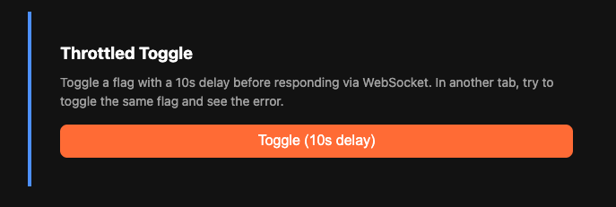
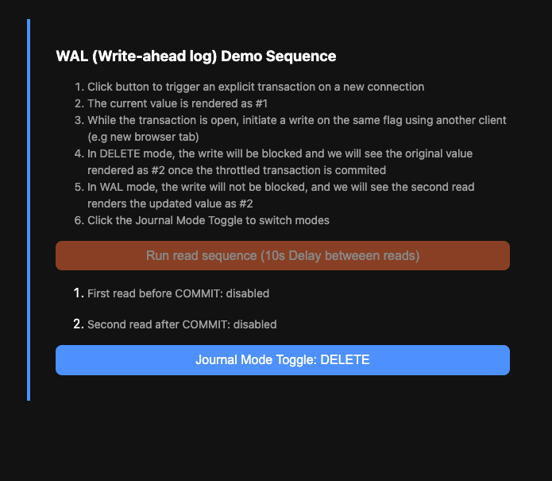

# Option 3 - Feature Flag Manager

## Overview

Basic feature flag service.

- The Dashboard manages a list of feature flags — each has a `name` and an `enabled` property.
  - Unique names are enforced.
  - Toggle On/Off (Only if user has seen the latest version of the enabled state).
  - Delete a Feature Flag (An in-progress read will still see previous value).
- The Test Page provides a playground for interacting with SQLite MVCC transactions.
- Provides an endpoint that allows clients to query a feature flag by name and get a boolean back.

```console
npm install
npm run build
npm start
# serves the Dashboard on http://localhost:3001
# serves the Test Page http://localhost:3001/test
```

### Dashboard Page



### Test Page



You can select a flag from the selector to see its properties.



Once a flag is selected, two test buttons become available:

### Throttled Toggle Button



Clicking this button triggers the same function call used on the Dashboard Page when you toggle a switch.
However, a 10-second timeout is triggered AFTER the transaction is complete is updated but BEFORE the clients are updated via websocket
If you open the Dashboard Page in another tab and attempt to toggle the flag that is currently selected on the Test Page, you will get a 409 CONFLICT error as the decision to trigger a DB Write was made without seeing the most up to date Read.
Eventually, when the timeout expires, you would see the update (and the button becomes active again)*

*Note: only the Feature Flag selected on the /test page is delayed, if you interact with additional flags on the Dashboard, it will trigger a normal, non-delayed refresh and we will see all updates before the process on /test page is complete

### Throttled Read Sequence



Clicking this button triggers a throttled explicit transaction on a new database connection.  While this transaction is running, we fire reads from the main connection to demonstrate the fundamental difference between DELETE and WAL mode.  In both modes, reads can occur from any connection but in DELETE mode, the database is locked during a transaction and reads will block writes (and vice versa).  You can manually trigger writes from another browser tab or curl and interact with the two modes.

## Additional Commands

### Local development

```console
npm install
npm run dev
```

- Client Dashboard (Vite dev server): <http://localhost:5173>
- Client Test Page: <http://localhost:5173/test>
- API server: <http://localhost:3001> (requests to `/api/*` are proxied from the client)

### Reset Database

SQLite persists its state as a file called app.db. This command will clear that file and the other cache files.

```console
npm run reset-db
```

### Code Quality

```console
npm test
npm run typecheck
npm run lint
npm run format
```

### Run in Docker (single localhost URL)

```console
docker compose up --build   # then open http://localhost:3001.
```

To run without compose:

```console
docker build -t amx-takehome .
docker run -p 3001:3001 -v amx-data:/app/data amx-takehome # then open http://localhost:3001.
```

## Feature flags API

| Method   | Route                          | Body                 | Notes                                |
| -------- | ------------------------------ | -------------------- | ------------------------------------ |
| `GET`    | `/api/flags`                   | —                    | List all flags, newest first         |
| `GET`    | `/api/flags/check?name={name}` | —                    | Returns a boolean                    |
| `POST`   | `/api/flags`                   | `{ name, enabled? }` | Create a flag (defaults to disabled) |
| `PATCH`  | `/api/flags/:id`               | `{ enabled }`        | Toggle a flag;                       |
| `DELETE` | `/api/flags/:id`               |                      | Delete a flag                        |

## TODO

- effect.ts is great for strong type-safety and concurrency with tight error handling, consider moving the websocket and event code into effect.ts
  - If not, new versions of node.js do support Native websockets so we could lose the dependency on ws
- support row-level websocket updates in order to scale to larger sets of feature flags
- right now we are using effect.ts `Schema` for /shared/errors.ts but we should expand the use of schema validation to remove casts
